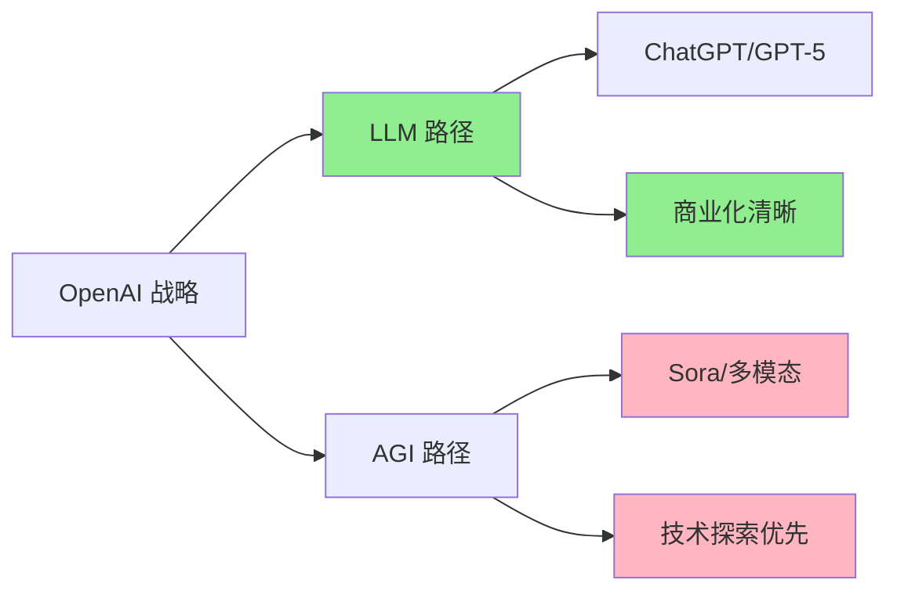

# Sora 倒下，国产 AI 视频能站起来吗？

> **核心摘要**：2026 年 3 月 25 日，OpenAI 突然宣布关停 Sora 视频生成服务。这款曾被誉为"AI 视频革命开创者"的产品，在燃烧了 100 亿美元后戛然而止。前一天还在和迪士尼开会的团队，第二天就收到了关停通知。Sora 之死，是 AI 视频泡沫的破灭，还是国产工具崛起的开始？


---

## 一、Sora 之死：一场蓄谋已久的"猝死"

**2026 年 3 月 25 日，周二。**

对于 OpenAI Sora 团队的 200 多名工程师来说，这是职业生涯中最黑暗的一天。

上午 10 点，全员会议紧急召开。OpenAI 管理层宣布：**Sora 服务将于 30 天后正式关闭**，用户数据可导出，订阅费用按比例退还。

消息传出，硅谷震动。


### 25 个月的辉煌与落寞

回顾 Sora 的生命历程，可谓"出道即巅峰"：

| 时间 | 事件 |
|------|------|
| 2024 年 2 月 | Sora 首次公开演示，60 秒视频生成惊艳全球 |
| 2024 年 6 月 | 邀请制内测开放，排队用户超 50 万 |
| 2024 年 12 月 | 正式订阅制上线，定价$30/月 |
| 2025 年 3 月 | 迪士尼宣布战略合作，计划用于电影前期可视化 |
| 2025 年 8 月 | 用户突破 200 万，日均生成视频 50 万条 |
| 2026 年 3 月 | 突然宣布关停，团队解散 |

### 1500 万美元/天：一个无底洞

根据《每日经济新闻》披露的数据，**Sora 平均每天燃烧 1500 万美元**。


这是什么概念？

- 一个月：4.5 亿美元
- 一年：165 亿美元
- 25 个月总投入：超过**100 亿美元**

OpenAI 的 IPO 招股书显示，Sora 的营收贡献不足 3%，却消耗了 40% 的算力资源。

**越火越亏，这是 Sora 无法回避的困局。**

---

## 二、Sora 为何非死不可？

### 原因一：单位经济模型不成立

Sora 采用订阅制收费：

| 套餐 | 价格 | 包含额度 | 实际成本 |
|------|------|----------|----------|
| 基础版 | $30/月 | 30 条视频 | 成本约$150 |
| 专业版 | $300/月 | 300 条视频 | 成本约$1500 |
| 企业版 | $3000/月 | 无限生成 | 成本约$15000+ |

**每卖出一份订阅，OpenAI 都在亏钱。**

视频生成需要海量 GPU 推理。根据用户实测，生成一条 10 秒 1080p 视频，需要：
- H100 GPU 约 0.5 小时
- 电力成本约$30
- 模型摊销约$50

而用户付费仅$1。

**这不是生意，这是慈善。**

### 原因二：LLM 与 AGI 的路线之争

Sora 之死，背后是 OpenAI 内部的技术路线分歧。



支持 LLM 路径的高管认为：
> "资源应该集中在 ChatGPT 和 GPT-5，这些产品有清晰的盈利模式"

支持 AGI 路径的研究员认为：
> "Sora 是多模态能力的核心，放弃 Sora 就是放弃 AGI"

最终，**IPO 压力让资本战胜了理想**。

### 原因三：迪士尼的"震惊"与无奈

据知情人士透露，关停决定宣布前一晚，Sora 团队还在和迪士尼高层开会，讨论 2026-2027 年的深度合作计划。

第二天，迪士尼收到了关停通知。

"深感震惊"——这是迪士尼发言人的公开表态。

背后是好莱坞的无奈：大量制片厂已将 Sora 纳入前期可视化流程，突然关停打乱了多个项目计划。

---

## 三、谁在接收 Sora 的遗产？

### 国际竞品：Runway、Pika、Luma

Sora 关停后，最大受益者来自竞争对手：

| 工具 | 国家 | 优势 | 估值变化 |
|------|------|------|----------|
| Runway Gen-3 | 美国 | 技术成熟，好莱坞认可 | +40% |
| Pika 1.5 | 美国 | 社区活跃，免费额度多 | +60% |
| Luma Dream Machine | 美国 | 速度快，成本低 | +80% |

**Luma 官方宣布**：Sora 用户迁移可享 3 个月免费专业版。

### 国产工具：可灵、即梦、海螺的机会

Sora 关停，给国产 AI 视频工具留下巨大市场真空：


#### 可灵 AI（快手）

- **优势**：中文理解最佳，支持 2 分钟长视频
- **定价**：每日免费 10 次，会员¥30/月
- **用户反馈**："生成质量接近 Sora，但等待时间较长"

#### 即梦 AI（字节跳动）

- **优势**：抖音生态，一键发布
- **定价**：首月¥9.9，后续¥58/月
- **用户反馈**："模板丰富，但创意空间有限"

#### 海螺 AI（MiniMax）

- **优势**：多模态融合，支持文 + 图 + 视频混剪
- **定价**：免费 + 增值服务
- **用户反馈**："技术能力强，但产品体验待优化"

---

## 四、Sora 留给我们的启示

### 启示一：技术领先≠商业成功

Sora 的技术实力毋庸置疑。

在多项基准测试中，Sora 的视频质量、物理一致性、长程依赖处理都领先行业 1-2 年。

但**技术优势无法弥补商业模式的缺陷**。

> "Sora 的墓碑上应该刻着：这里躺着一个技术天才，但它不会赚钱"

### 启示二：AI 视频的单位经济模型仍是难题

Sora 的困境，本质是 AI 视频行业的共性问题：

```
收入 = 用户数 × 付费率 × ARPU
成本 = 用户数 × 人均使用量 × 单次成本

当 单次成本 > ARPU 时，增长越快，死亡越快
```

### 启示三：国产工具的窗口期

Sora 退出后，行业出现 12-18 个月的窗口期：

- **技术层面**：国产工具与 Runway/Pika 差距在 6 个月内
- **市场层面**：200 万 Sora 用户需要迁移
- **资本层面**：投资人开始关注 AI 视频赛道

**谁能抓住这次机会？**

---

## 五、写给创作者：如何应对工具变迁？

如果你是用 AI 视频工具进行创作，建议：

### 1. 多工具备份

不要依赖单一工具，建立工具矩阵：

```
主力工具（60%）：可灵 AI / Runway
备用工具（30%）：即梦 AI / Pika
探索工具（10%）：海螺 AI / Luma
```

### 2. 建立本地素材库

将重要视频下载到本地，避免云端数据丢失。

### 3. 关注工具的单位经济模型

选择工具时，不仅看生成质量，还要评估：
- 单次生成成本
- 盈利模式是否可持续
- 背后公司的资金支持

---

## 结语：Sora 死了，但梦想还活着

2024 年 2 月，Sora 第一条演示视频发布时，全网沸腾。

那段 60 秒的视频里，有我们对 AI 视频的所有想象：电影、广告、游戏、教育……

25 个月后，Sora 倒在了商业化的路上。

**但 AI 视频的梦想，没有死。**

Runway、Pika、可灵、即梦……这些名字正在接过 Sora 的火炬。

或许 5 年后，当我们回看这段历史，会说：

> "Sora 是 AI 视频界的协和客机——技术超前，生不逢时，但它为后来者铺平了道路。"

---

**参考资料**：
1. 每日经济新闻：《Sora 猝死 25 个月：每天烧掉 1500 万美元》
2. 知乎热榜：《如何评价 OpenAI 突然宣布关停 Sora 服务？》
3. 36 氪：《AI 视频赛道洗牌：Sora 关停后的市场格局》
4. 晚点 LatePost：《OpenAI 的 IPO 阳谋》

---

*本文数据来源：公开报道、知乎讨论、行业分析报告*

*封面图生成：baoyu-cover-image*
