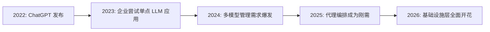
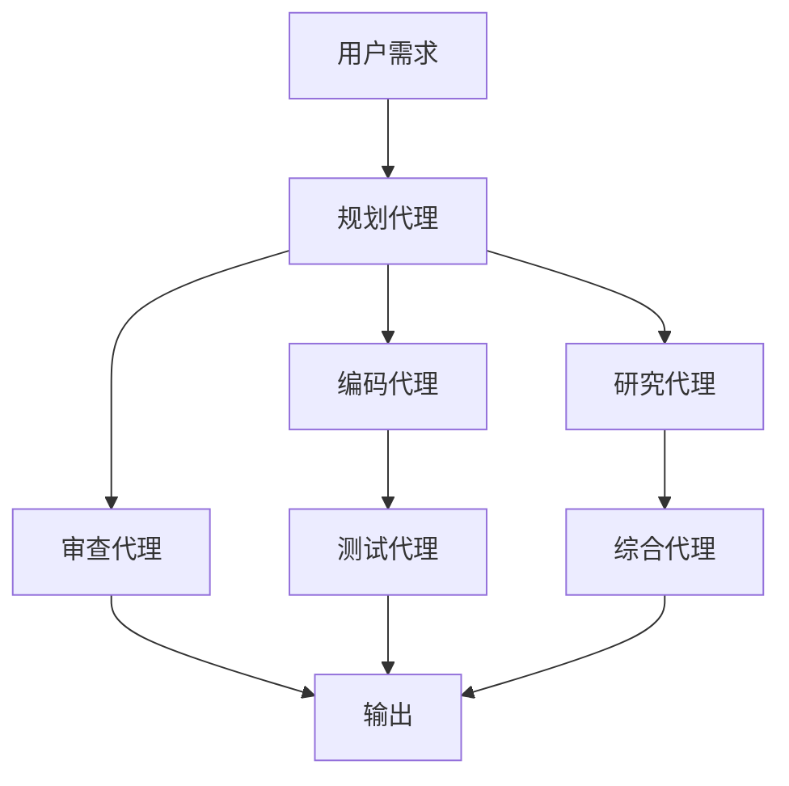
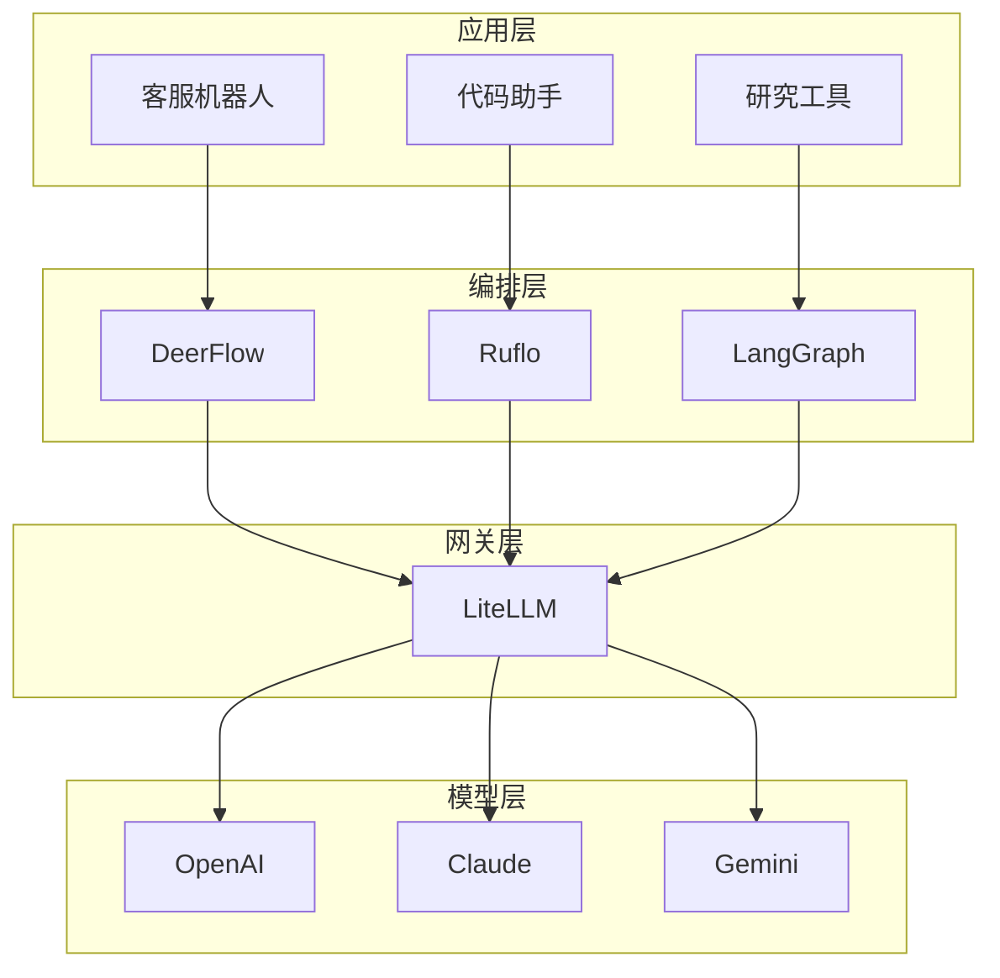

# GitHub TOP5 中 4 个是 AI 代理基础设施，说明了什么？

## 引子

今天翻看 GitHub Trending，一个数据让我停住了：

**TOP5 热门仓库中，4 个直接做 AI 代理/LLM 基础设施。**

这不是巧合。这是一个信号。

当开发者集体用 Star 投票时，他们投出的是一个清晰的技术拐点：**AI 代理基础设施时代，来了。**

---

## 一、榜单解读：4/5 都是代理基建

先快速回顾下这份榜单：

| 排名 | 仓库 | Stars | 类别 |
|------|------|-------|------|
| 1 | last30days-skill | 7,800 | 社交研究代理 |
| 2 | deer-flow（字节） | 46,398 | SuperAgent 编排 |
| 3 | litellm | 40,688 | LLM 网关 |
| 4 | editor | 6,878 | 3D 设计工具 |
| 5 | ruflo | 26,264 | 多代理 Swarm |

**4 个 AI 代理相关，1 个 3D 可视化。**

这意味着什么？

---

## 二、根因分析：为什么是现在？

### 2.1 技术成熟度曲线到达拐点

AI 代理基础设施爆发，不是突然发生的。它遵循一个清晰的技术采纳路径：



**关键转折点：**

- **单模型 → 多模型**：企业不再满足于"用一个 LLM"，而是需要同时调用 GPT-4、Claude、Gemini 等
- **单次调用 → 工作流**：简单问答已不够用，需要多步骤、多代理协作
- **实验 → 生产**：POC 项目必须变成稳定运行的生产系统

### 2.2 三大核心驱动力

#### 驱动力 1：碎片化痛苦

> "我们接了 6 个 LLM 提供商，每个 API 都不一样。"

这是 2025 年企业技术团队的真实写照。

LiteLLM 之所以能拿到 40K+ Stars，核心原因是它解决了**最痛的点**：

- 统一 API 格式（OpenAI 兼容）
- 跨提供商成本追踪
- 集中式鉴权和限流
- 自动重试和负载均衡

**本质上，它是一个 AI 时代的 API 网关。**

#### 驱动力 2：复杂性爆炸

单个 Agent 能做什么？

- 回答一个问题
- 执行一个简单任务

但真实业务场景要复杂得多：



这就是 **Multi-Agent Swarm** 的价值。

字节开源的 DeerFlow 之所以能成为 Trending TOP2，核心是它提供了：

- 子代理自动编排
- 沙盒执行环境
- 长短期记忆管理
- 多渠道接入（Slack/Telegram/飞书）

**它让 Agent 从"能聊天"变成"能干活"。**

#### 驱动力 3：成本压力

这是一个很少被公开讨论但极其现实的问题：

> 一家企业如果每天调用 10 万次 LLM API，月成本可能高达数十万美元。

这就是为什么 Ruflo 这类框架强调 **"WASM 转换跳过 LLM 调用"** 和 **"语义路由"**：

- 简单任务（如格式转换）用 WASM 处理，352 倍速度提升
- 复杂任务才路由到 LLM
- 通过向量缓存避免重复计算

**省下的 Token，都是纯利润。**

---

## 三、深层逻辑：基础设施层的"军镐效应"

淘金热中，最赚钱的不是淘金者，是卖铲子和牛仔裤的人。

AI 代理时代，同样如此。



**价值分布：**

| 层级 | 特点 | 代表项目 |
|------|------|----------|
| 应用层 | 直接面向用户，但竞争激烈 | 各类 AI 助手 |
| 编排层 | 技术壁垒高，粘性强 | DeerFlow, Ruflo, LangGraph |
| 网关层 | 标准化程度高，易形成垄断 | LiteLLM |
| 模型层 | 资本密集，巨头游戏 | OpenAI, Anthropic, Google |

**投资逻辑：**

- 应用层：高风险高回报，90% 会失败
- 编排层：技术护城河深，适合技术驱动型公司
- 网关层：网络效应明显，容易形成事实标准
- 模型层：只有巨头能玩

---

## 四、后续发展方向：2026-2027 预测

基于当前趋势，我判断代理基础设施将向以下方向演进：

### 4.1 短期（6-12 个月）

1. **标准化加速**
   - MCP（Model Context Protocol）成为代理 - 工具连接标准
   - A2A（Agent-to-Agent）协议统一多代理通信

2. **性能竞赛**
   - 向量检索延迟从毫秒级降至微秒级（如 Ruflo 的 61µs）
   - WASM 预处理成为标配，减少 LLM 调用

3. **可观测性工具爆发**
   - 类似 Lunary、Langfuse 的代理行为追踪平台
   - 调用链分析、成本归因、异常检测

### 4.2 中期（12-24 个月）

1. **边缘代理兴起**
   - 小型模型本地运行（Ollama + WASM）
   - 敏感数据不出域，合规性提升

2. **代理市场形成**
   - 类似 npm/PyPI 的代理技能市场
   - 预训练代理即插即用

3. **安全与治理**
   - 代理权限隔离和审计
   - 防注入、防越狱、防数据泄露

### 4.3 长期（24+ 个月）

1. **自主代理生态**
   - 代理能自主发现任务、分解执行、付费调用其他代理
   - 出现"代理经济体"

2. **人机协作新范式**
   - 人类从"操作者"变为"审核者"和"目标制定者"
   - 代理自主完成 80%+ 的常规任务

---

## 五、对开发者的启示

### 5.1 技术选型建议

如果你正在评估代理基础设施：

| 需求 | 推荐方案 |
|------|----------|
| 多模型统一管理 | LiteLLM |
| 复杂工作流编排 | DeerFlow / LangGraph |
| 高性能向量检索 | Ruflo (RuVector) |
| 社交/舆情研究 | last30days-skill |

### 5.2 职业机会

**紧缺岗位：**

- Agent 架构师（设计多代理系统）
- 提示工程专家（优化代理行为）
- 代理安全工程师（防注入、防越狱）
- 向量数据库专家（高性能检索）

**技能栈建议：**

```
核心：Python/TypeScript + LangChain/LangGraph
进阶：WASM + 向量数据库 + 分布式系统
高阶：强化学习 + 知识图谱 + 共识算法
```

---

## 六、冷思考：繁荣背后的隐忧

在兴奋之余，也需要保持清醒：

### 隐忧 1：过度工程化

> "能用一个函数解决的问题，是否需要一个 Agent Swarm？"

不是所有场景都需要多代理编排。警惕**为了用 Agent 而用 Agent**。

### 隐忧 2：供应商锁定

虽然 LiteLLM 等工具声称"消除供应商锁定"，但：

- LangGraph 生态绑定 LangChain
- 各框架的代理定义格式不兼容
- 向量数据库之间迁移成本高

### 隐忧 3：调试复杂度

单个 LLM 调用已经难以调试，多代理系统的可观测性更是指数级上升：

- 如何追踪代理决策链？
- 如何复现偶发 Bug？
- 如何测试 Agent 的"创造性"输出？

---

## 结语：基础设施已就位，应用爆发在即

回到开头的问题：**为什么 GitHub Trending 被 AI 代理基础设施霸榜？**

答案很简单：

> **淘金热开始了，每个人都想要一把更好的铲子。**

2023 年，我们在讨论"LLM 能做什么"。
2024 年，我们在尝试"用 LLM 做个小工具"。
2025 年，我们在构建"能自主工作的 Agent 系统"。
2026 年，基础设施就位，**应用层爆发一触即发**。

下一个问题：

**谁会是 AI 代理时代的"杀手级应用"？**

我的猜测：不是聊天机器人，不是代码助手，而是我们还没想象过的东西。

毕竟，在互联网早期，没人能预测到会出现"短视频"这个行业。

---

*本文基于 GitHub Trending 2026-03-26 数据分析*

*参考资料：GitHub Trending、各项目官方文档、行业分析报告*
