> 和平需要勇气，而非武器。

当三架 F-35I 战斗机划破夜空，当数百枚导弹划过长空，当中东地图再次被战火染红——你是否也曾困惑：**这片土地为什么总是打仗？美国、以色列、伊朗之间到底有什么深仇大恨？**

今天，我们用一部原创的**19 页教育漫画**，带你理清这段跨越 47 年的复杂恩怨。从 1979 年伊斯兰革命到 2026 年的未来预测，一场地缘政治的风云变幻，即将在你眼前展开。

---

## 三大主角登场：一场三角博弈

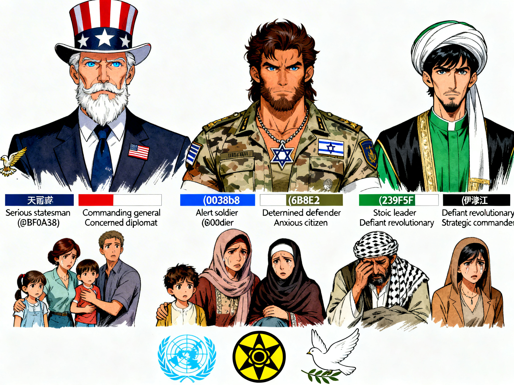
*三大主角角色设计图*

🇺🇸 **山姆大叔（美国）** — 白色山羊胡、深色西装、星条旗胸针

**核心诉求**：
- 遏制伊朗核能力
- 保护以色列
- 确保石油供应
- 避免地面战争

🇮🇱 **犹大狮子（以色列）** — 军人装束、大卫之星项链、警惕的眼神

**核心诉求**：
- 消除伊朗核威胁（这是生存问题！）
- 打击代理人网络
- 维持军事优势

🇮🇷 **波斯狮（伊朗）** — 头巾、教士袍、坚定的目光

**核心诉求**：
- 维护政权生存
- 扩大地区影响力
- 获得制裁解除
- 核技术作为筹码

> **这就像一场高风险的三人牌局，每一方都握有自己的底牌，每一个决定都可能引爆整个中东。**

---

## 第一幕：历史根源（1979-2015）仇恨的种子

### 1979 年：一切改变的开始

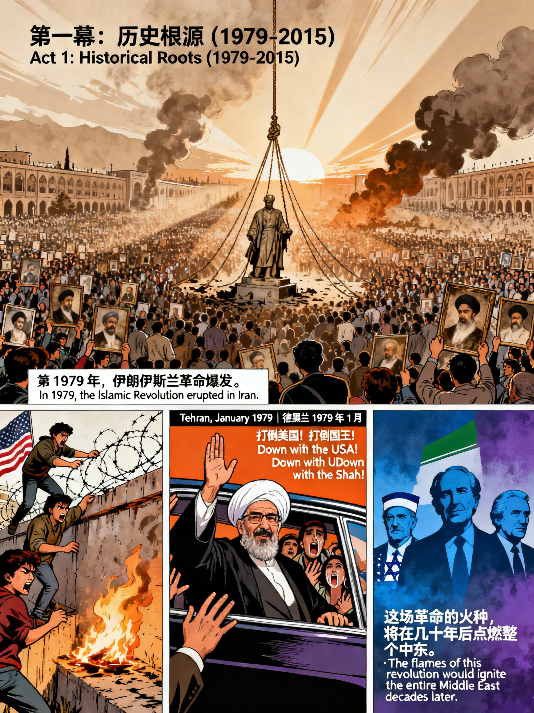
*1979 年，德黑兰街头，伊朗伊斯兰革命爆发*

德黑兰街头，百万人游行，国王的雕像被推倒，霍梅尼的肖像遍布全城。

「打倒美国！打倒国王！」的口号响彻云霄。

这一年，**伊朗伊斯兰革命爆发**，亲西方的巴列维王朝被推翻。美国大使馆人质危机，标志着美伊关系彻底破裂。

> 这场革命的火种，将在几十年后点燃整个中东。

### 1980-1988 年：两伊战争，百万人丧生

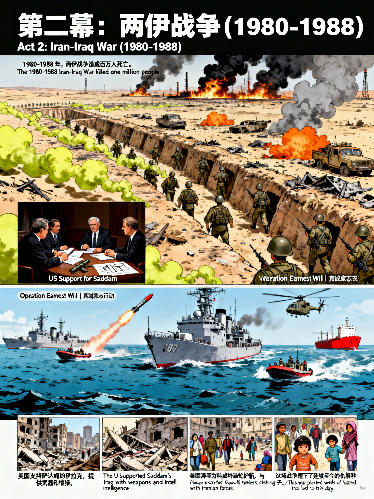
*1980-1988 年，两伊战争造成百万人死亡*

伊拉克与伊朗的边境，战火纷飞。美国选择支持萨达姆的伊拉克，提供武器和情报。

1987 年，美国海军为科威特油轮护航，与伊朗海军交火。**仇恨的种子，越埋越深。**

### 2002-2015 年：核计划阴云

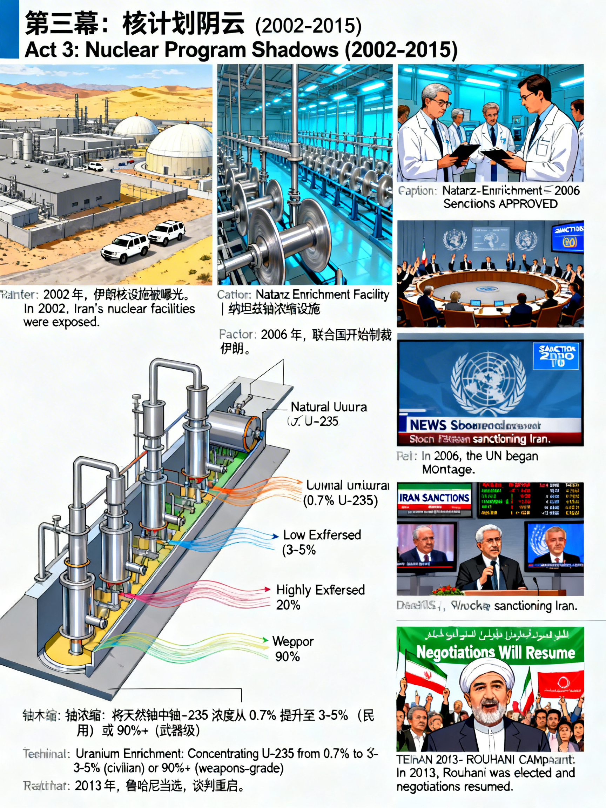
*伊朗纳坦兹核设施，离心机运转*

2002 年，伊朗纳坦兹核设施被曝光。国际社会开始担心：伊朗是不是在发展核武器？

- **2006 年**：联合国开始制裁伊朗
- **2013 年**：鲁哈尼当选，谈判重启
- **2015 年**：历史性时刻——核协议签署！

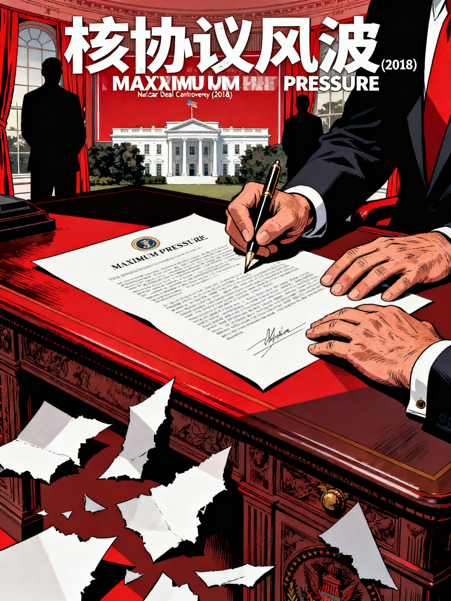
*2015 年，维也纳，各国代表签署伊核协议*

维也纳，各国代表握手。伊朗与 P5+1（美英法俄中 + 德）签署《联合全面行动计划》（JCPOA），伊朗限制核活动，换取制裁解除。

**当时所有人都以为，和平终于来了。**

---

## 第二幕：紧张升级（2018-2024）影子战争

### 2018 年：美国退出，极限施压

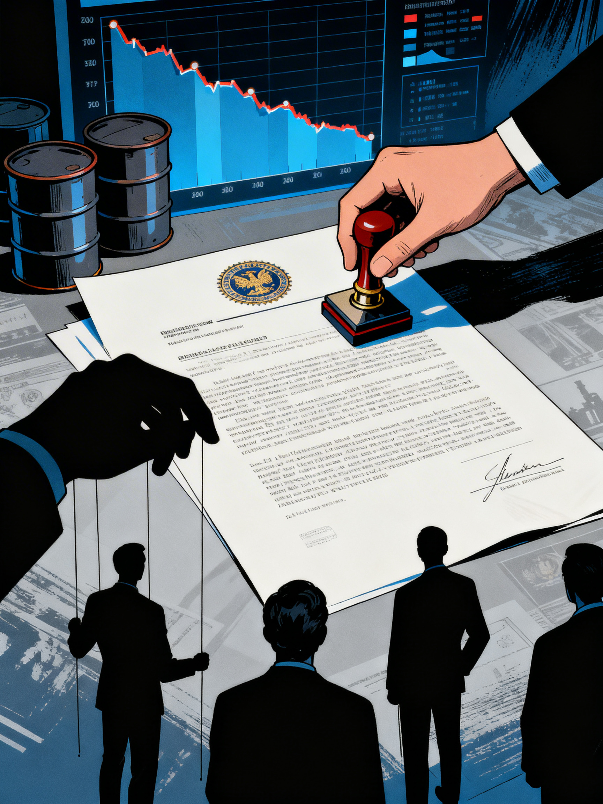
*2018 年，特朗普政府单方面退出伊核协议*

白宫，特朗普坐在办公桌前，签署行政令。

> 「这是一份糟糕的协议。」

美国单方面退出伊核协议，恢复「极限施压」政策。伊朗的反应很明确：**既然你们不守约，那我也不限制了。**

铀浓缩活动，开始悄悄恢复。

### 2020 年：苏莱曼尼之死，中东濒临战争边缘

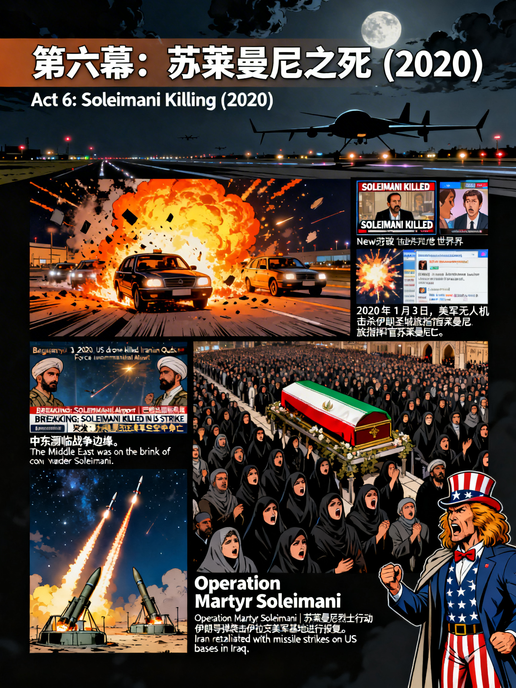
*2020 年 1 月，伊朗圣城旅指挥官苏莱曼尼在巴格达机场遇刺*

巴格达机场，夜色中，一架美军无人机锁定了一支车队。

导弹落下，爆炸。伊朗圣城旅指挥官苏莱曼尼，当场身亡。

伊朗的反应震动了世界：导弹袭击伊拉克美军基地进行报复。**那一刻，中东距离全面战争只有一步之遥。**

### 2020-2024 年：影子战争

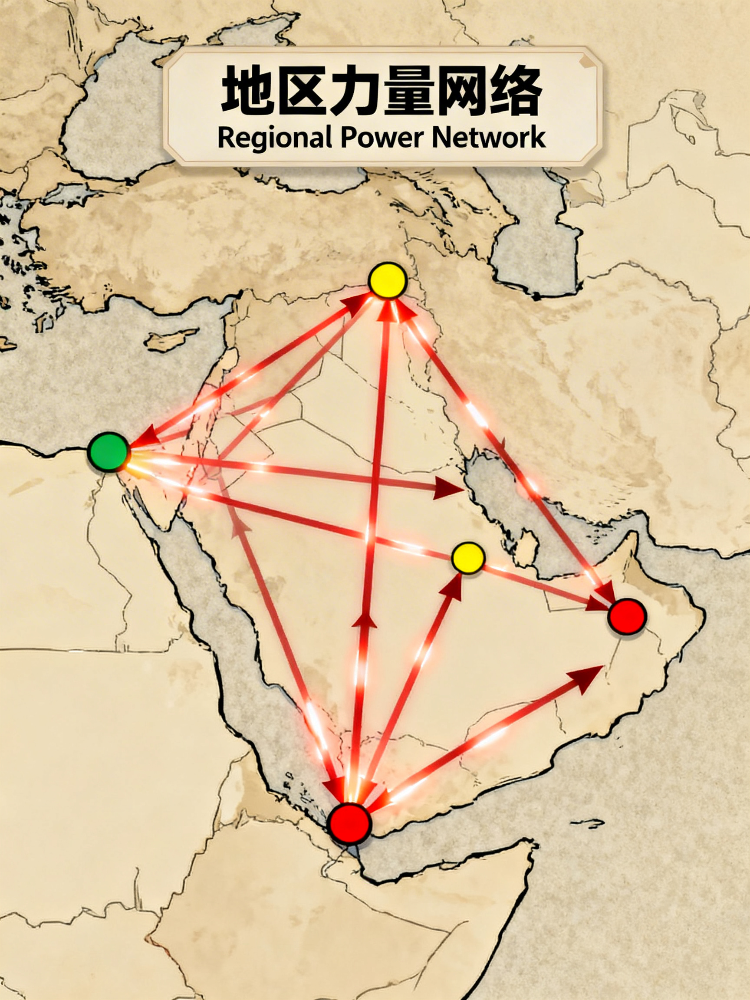
*伊朗通过「抵抗轴心」代理人网络扩大地区影响力*

这不是传统战争，却同样致命：

- 伊朗核科学家法赫里扎德遇刺（2020 年 12 月）
- 纳坦兹核设施多次发生「神秘」爆炸
- 网络攻击、破坏行动、暗杀……

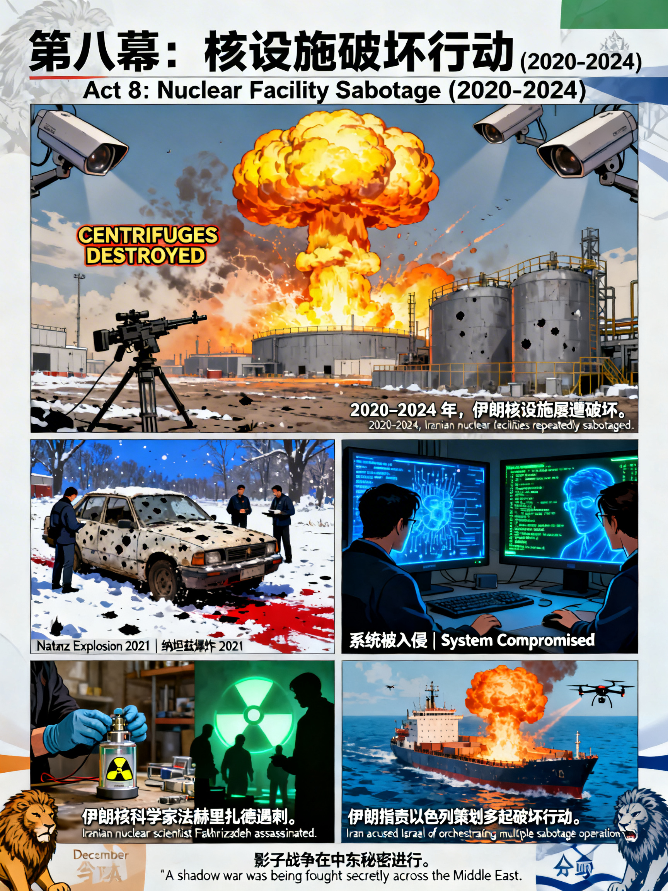
*影子战争：核设施爆炸、科学家遇刺、网络攻击*

伊朗指责以色列策划了多起破坏行动。**影子战争在中东秘密进行，所有人都心知肚明，但谁也不承认。**

---

## 第三幕：全面对抗（2025-2026）最危险的时刻

### 2025 年初：铀浓缩升级至 84%

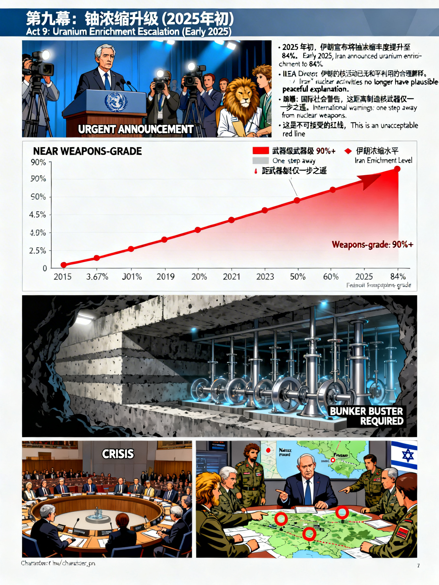
*2025 年，伊朗将铀浓缩丰度提升至 84%，距离武器级仅一步之遥*

国际原子能机构（IAEA）召开紧急新闻发布会：

> 「伊朗已将铀浓缩丰度提升至 84%。」

**距离武器级的 90%，仅一步之遥。**

以色列的反应极其强烈：这是不可接受的红线！

### 2025 年 4 月：以色列发动空袭

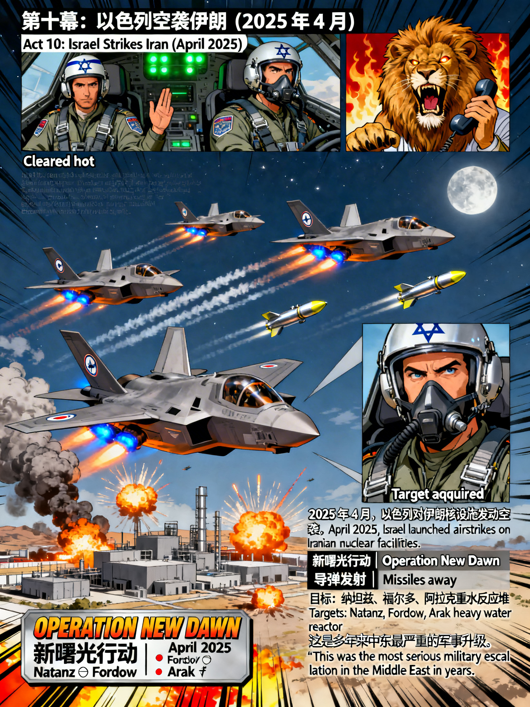
*2025 年 4 月，以色列发动「新曙光行动」空袭伊朗核设施*

代号「新曙光行动」。

F-35I 隐身战斗机编队飞行，导弹从内部弹舱发射。目标：纳坦兹、福尔多、阿拉克重水反应堆。

这是多年来中东最严重的军事升级。

### 2025 年 4-6 月：伊朗报复

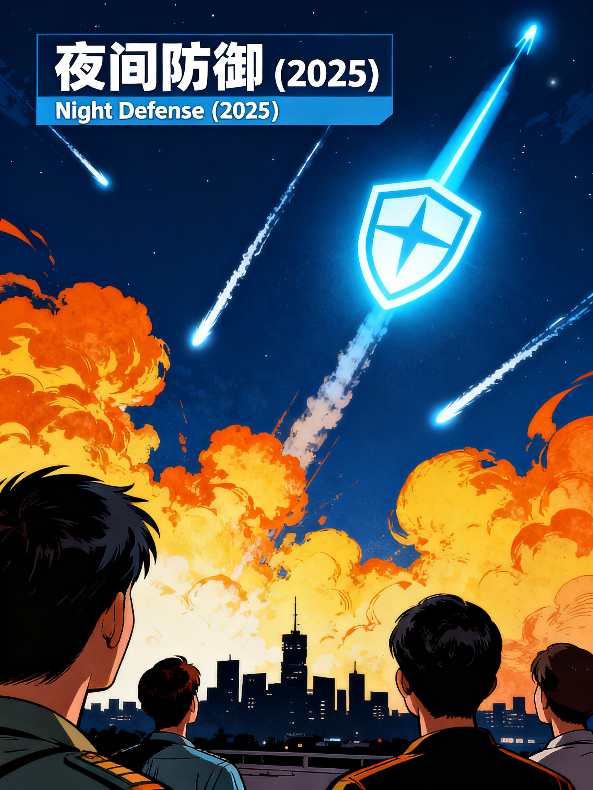
*伊朗发动「真实承诺」行动，向以色列发射数百枚导弹*

伊朗发动「真实承诺」行动，向以色列发射数百枚导弹和无人机：

- 法塔赫 -110 弹道导弹
- 沙赫德 -136 自杀式无人机
- 巡航导弹

以色列的铁穹系统全力拦截，夜空被爆炸和拦截弹照亮。**但仍有部分导弹击中了目标。**

### 2025 年 5 月：美国介入

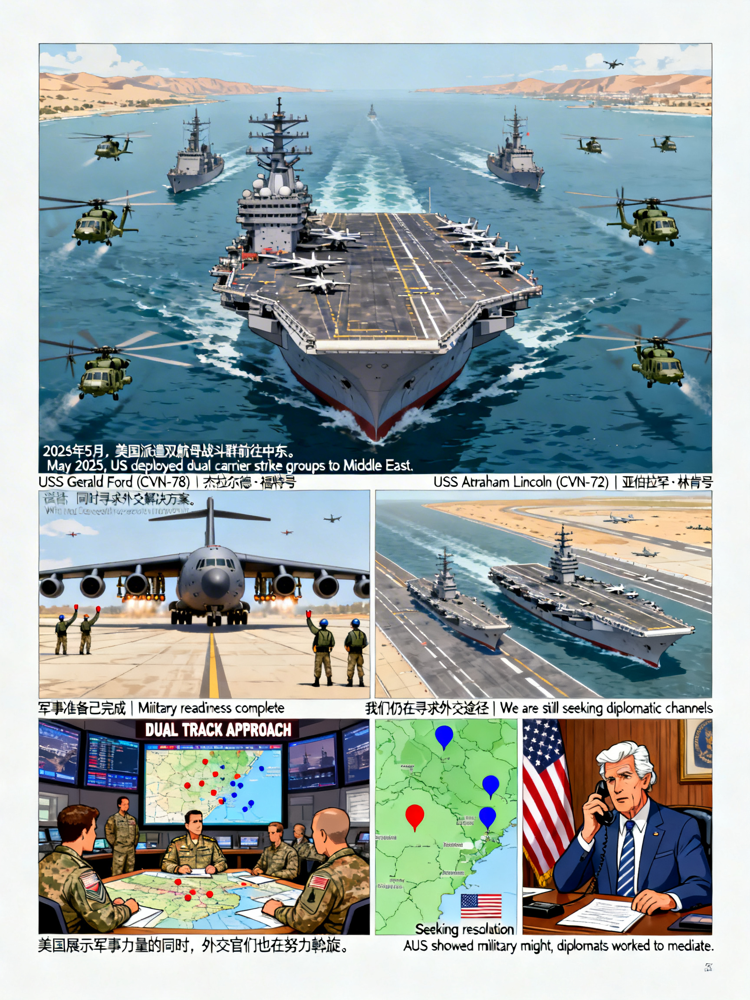
*2025 年 5 月，美国双航母战斗群进入波斯湾*

两艘美国航母战斗群进入波斯湾：

- 杰拉尔德·福特号（CVN-78）
- 亚伯拉罕·林肯号（CVN-72）

B-52 轰炸机部署到卡塔尔基地。

> **美国传递的信号很明确：以色列，我支持你；伊朗，别太过分。**

### 2025 年 6-8 月：地区战火蔓延

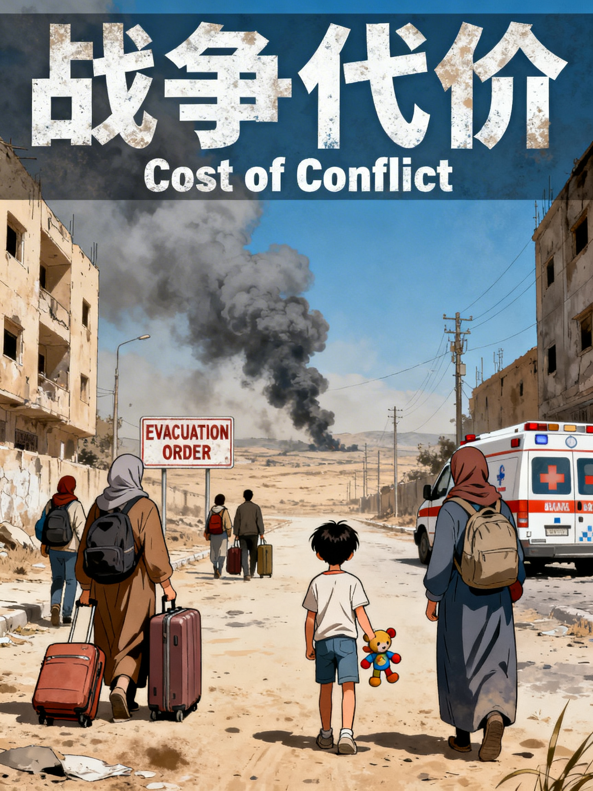
*真主党加入战斗，以色列北部数万居民被迫撤离*

黎巴嫩真主党加入战斗，从北部向以色列发射火箭弹。

以色列北部数万居民被迫撤离。城市遭袭，家庭逃难，医院人满为患。

> **战争的代价，最终由平民承担。**

### 2025 年 9 月：外交斡旋

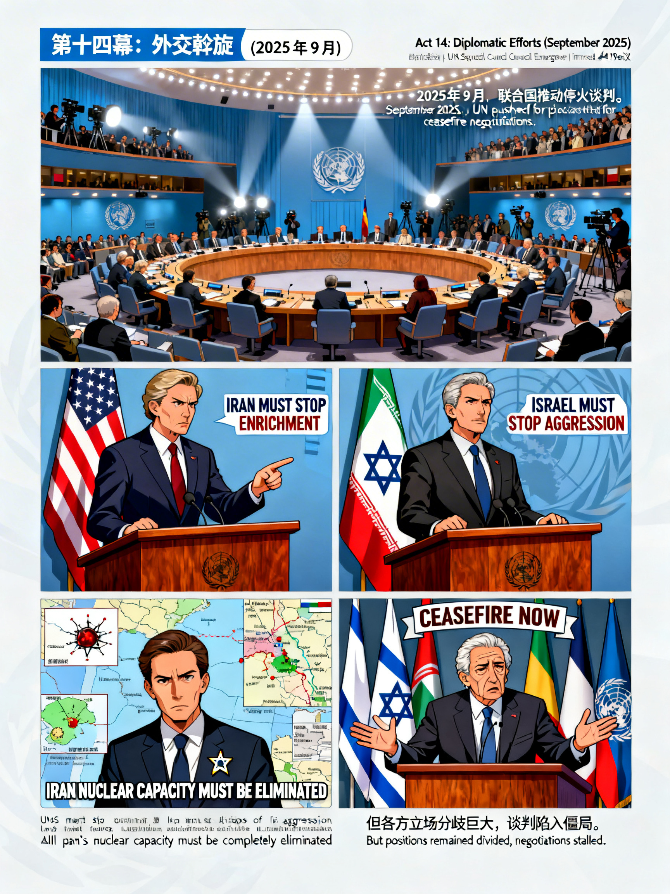
*2025 年 9 月，联合国安理会召开紧急会议*

联合国安理会紧急会议，各国代表激烈辩论。

| 国家 | 立场 |
|------|------|
| 🇺🇸 美国 | 「伊朗必须停止铀浓缩」 |
| 🇮🇷 伊朗 | 「以色列必须停止侵略」 |
| 🇮🇱 以色列 | 「伊朗核能力必须被彻底摧毁」 |

立场分歧巨大，谈判陷入僵局。

---

## 第四幕：未来走向（2026）三种可能

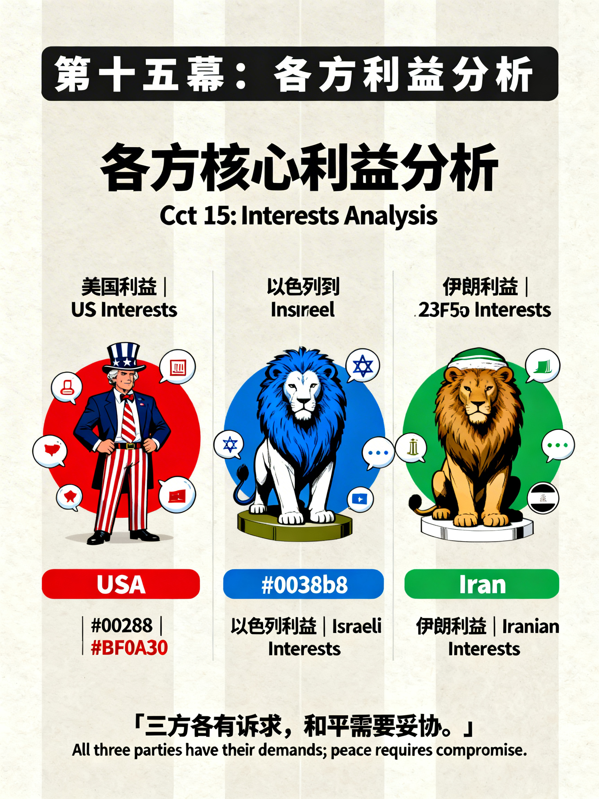
*美以伊三方核心利益分析*

基于专家分析，我们为 2026 年预测了三种情景：

### 情景 A：有限协议（概率 40%）🟢

- 伊朗暂停高丰度浓缩
- 美国部分解除制裁
- 紧张局势缓和，但问题未根本解决

**这是最可能的结果——不完美，但至少避免了战争。**

### 情景 B：持续对抗（概率 45%）🟡

- 低强度冲突持续
- 代理人战争继续
- 外交谈判停滞

**维持现状，不战不和，这是过去十年的常态。**

### 情景 C：全面战争（概率 15%）🔴

- 以色列大规模空袭伊朗核设施
- 伊朗封锁霍尔木兹海峡（全球 30% 石油运输通道）
- 地区大国卷入

**这是所有人都不想看到，但必须警惕的剧本。**

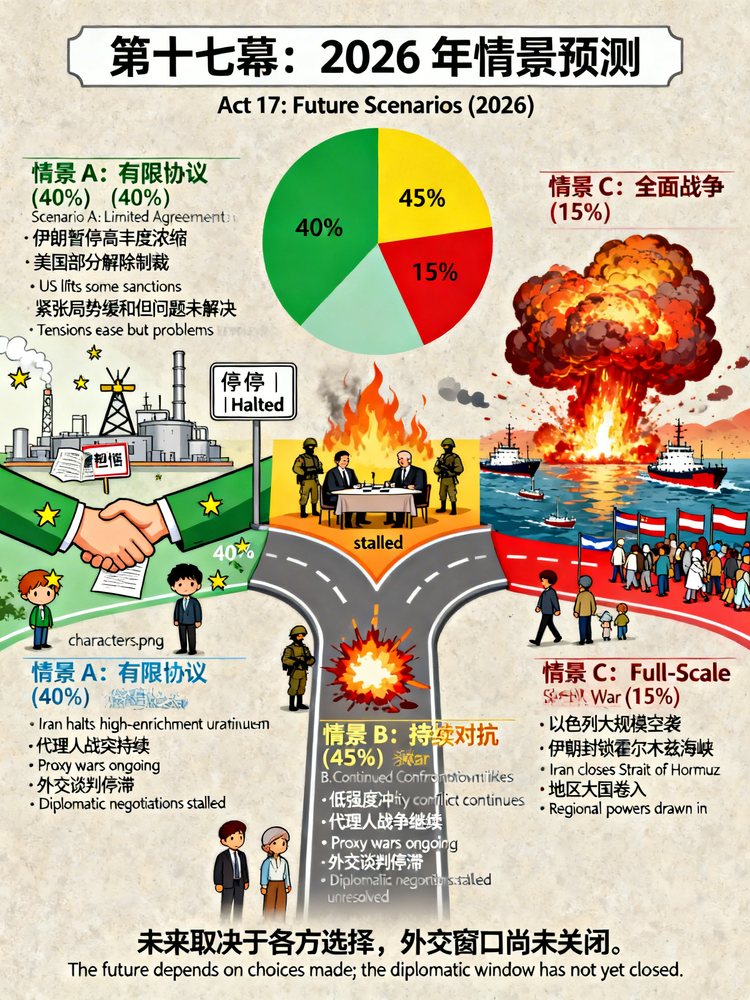
*2026 年三种可能的未来走向*

---

## 地区国家态度：谁在支持谁？

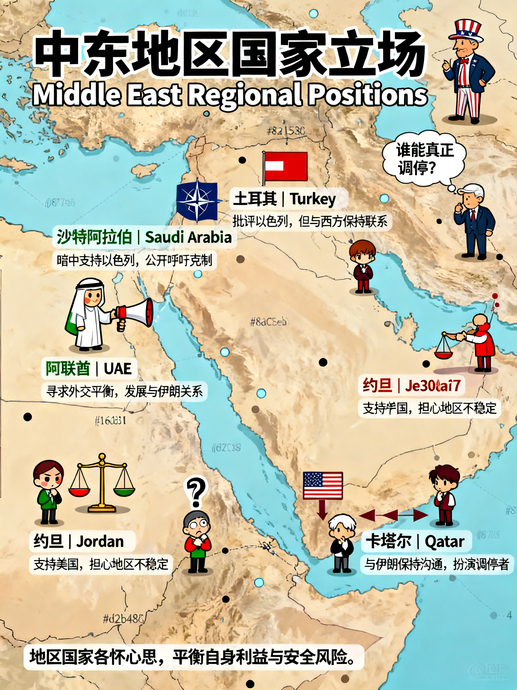
*中东地区各国在这场冲突中的立场*

在这场冲突中，其他中东国家是什么态度？

| 国家 | 立场 |
|------|------|
| 🇸🇦 沙特阿拉伯 | 暗中支持以色列，公开呼吁克制 |
| 🇦🇪 阿联酋 | 寻求外交平衡，发展与伊朗关系 |
| 🇯🇴 约旦 | 支持美国，担心地区不稳定 |
| 🇶🇦 卡塔尔 | 与伊朗保持沟通，扮演调停者 |
| 🇹🇷 土耳其 | 批评以色列，但与西方保持联系 |

> **每个人都在这场博弈中寻找自己的位置，没有绝对的盟友，只有永恒的利益。**

---

## 战争的代价：平民视角

让我们看看战争对普通人意味着什么：

- 被炸毁的公寓楼
- 流离失所的家庭，孩子抱着玩具回望家园
- 医院里挤满伤员，医生连续工作 36 小时
- 葬礼上，母亲抱着遗像痛哭

**在宏大叙事背后，是一个个破碎的人生。**

以色列平民在防空洞里颤抖，伊朗平民在经济制裁下挣扎，巴勒斯坦平民在战火中流离失所。

> **战争没有赢家，平民永远是代价。**

---

## 尾声：和平需要勇气

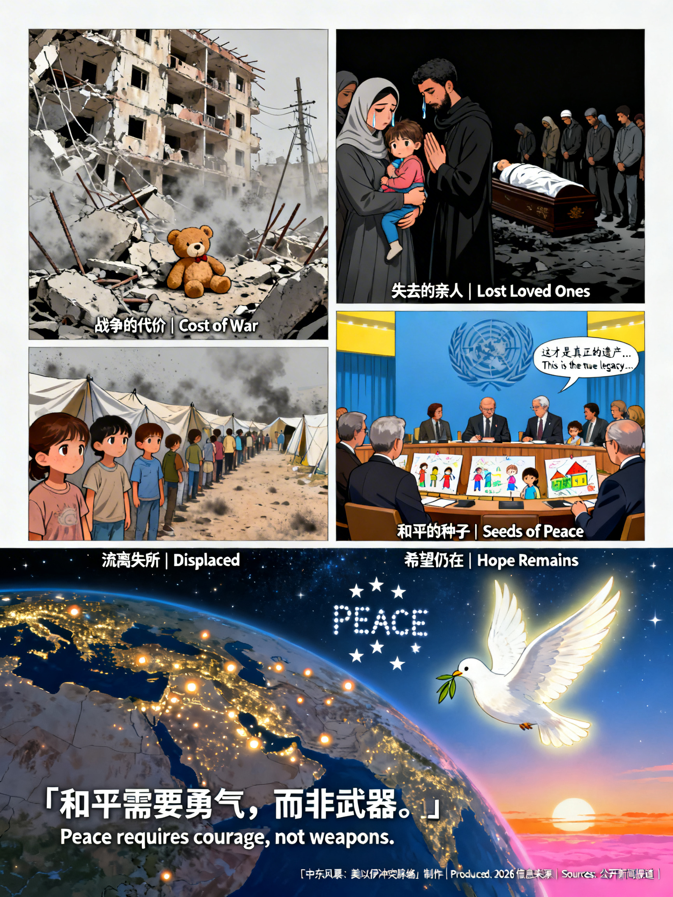
*和平需要勇气，而非武器*

漫画的最后一页，是这样一个画面：

中东地图的夜景，但不是军事基地的灯光，而是学校、医院、文化设施的温暖光芒。

一只和平鸽飞过，口中衔着橄榄枝。

地平线上，黎明的曙光正在升起。

> 「和平需要勇气，而非武器。」
>
> "Peace requires courage, not weapons."

---

## 结语：理解，是和平的第一步

这部 19 页的原创漫画《中东风暴》，用图像和故事理清了美以伊 47 年的恩怨情仇。

**我们为什么要理解这场冲突？**

因为中东的局势，影响着全球油价、影响着国际关系、影响着每一个人的生活。

因为理解他者的立场，才能找到对话的可能。

因为战争的代价太沉重，和平的努力再小也值得。

---

**📖 漫画资源**

- 完整 PDF（24MB，19 页）：`comic/middleeast-conflict/middleeast-conflict.pdf`
- 中英双语，适合收藏和分享
- 教育用途，欢迎传播

---

**💬 互动话题**

你认为 2026 年最可能发生哪种情景？

- A. 有限协议（40%）
- B. 持续对抗（45%）
- C. 全面战争（15%）

欢迎在评论区留下你的看法。

---

**🔗 参考资料**

- Wikipedia: Iran-Israel conflict, Iran nuclear program
- Reuters: Middle East coverage
- BBC: Middle East analysis
- Council on Foreign Relations reports
- International Institute for Strategic Studies (IISS)

---

*本文基于公开信息创作，旨在促进理解，而非煽动对立。*

*漫画使用 AI 生成，采用象征性人物设计。*

---

**喜欢这篇文章吗？欢迎点赞、在看、分享三连～**

**关注我，获取更多深度内容。**
